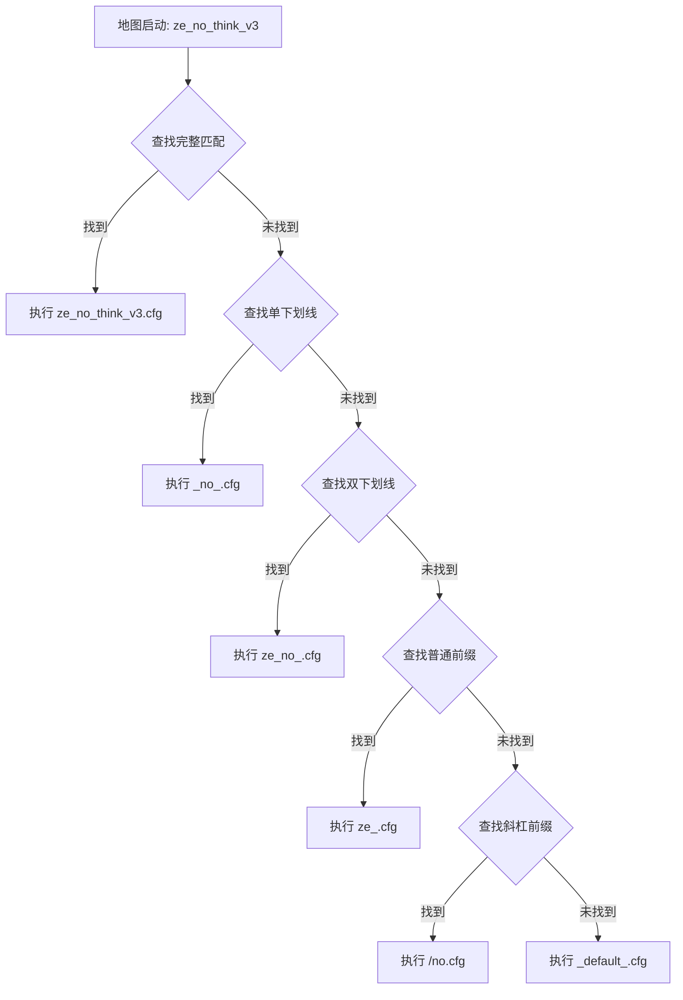

# ZeRo_MapCvar 使用指南

## 目录
- [系统概述](#系统概述)
- [工作原理](#工作原理)
- [文件结构](#文件结构)
- [配置文件命名规则](#配置文件命名规则)
- [执行优先级](#执行优先级)
- [使用方法](#使用方法)
- [实际应用示例](#实际应用示例)
- [调试和故障排除](#调试和故障排除)

## 系统概述

### 核心功能
ZeRo_MapCvar 是一个智能地图配置系统，能够根据地图名称自动匹配并执行对应的配置文件。该系统具有以下特点：

✅ **智能匹配** - 支持多种命名规则和匹配优先级  
✅ **多时机执行** - 支持地图开始、回合开始等多种触发时机  
✅ **重复执行** - 可配置重复执行次数确保配置生效  
✅ **错误日志** - 可选的详细错误日志记录  
✅ **自动兜底** - 多层默认配置保障系统稳定性  

## 工作原理

### 执行流程
```
地图启动 → 检查系统配置 → 匹配配置文件 → 按优先级执行 → 重复执行(可选) → 记录日志
```

### 核心步骤
1. **地图启动检测** - 监听地图开始事件
2. **配置文件搜索** - 按5个优先级顺序查找
3. **智能匹配执行** - 找到匹配文件后执行
4. **重复执行保障** - 确保配置在游戏环境中生效
5. **错误日志记录** - 记录执行状态和错误信息

## 文件结构

### 主目录结构
```
csgo/
└── cfg/
    └── ZeRo_MapCvar_Config/          # 配置文件主目录
        ├── ze_example_map.cfg        # 完整地图名配置
        ├── _example_.cfg             # 单下划线前缀配置
        ├── ze_example_.cfg           # 双下划线前缀配置
        ├── ze_.cfg                   # 普通前缀配置
        ├── /example.cfg              # 斜杠前缀配置
        └── _default_.cfg             # 默认兜底配置
```

### 配置文件类型
```bash
# 配置文件查找路径
csgo/cfg/ZeRo_MapCvar_Config/
```

## 配置文件命名规则

### 5种匹配优先级

#### 1. 完整地图名匹配 (最高优先级)
```bash
# 对于地图: ze_no_think_v3
ze_no_think_v3.cfg  # 精确匹配，优先级最高
```

#### 2. 单下划线前缀匹配
```bash
# 对于地图: ze_no_think_v3
_no_.cfg            # 匹配中间的 _no_ 部分
```

#### 3. 双下划线前缀匹配
```bash
# 对于地图: ze_no_think_v3
ze_no_.cfg          # 匹配前两个下划线部分
```

#### 4. 普通前缀匹配
```bash
# 对于地图: ze_no_think_v3
ze_.cfg             # 匹配第一个下划线前的部分
```

#### 5. 斜杠前缀匹配 (最低优先级)
```bash
# 对于地图: ze_no_think_v3
/no.cfg             # 匹配第二个下划线后的部分(去除下划线和版本号)
```

## 执行优先级

### 优先级顺序表

| 优先级 | 匹配类型 | 示例地图 `ze_no_think_v3` | 对应文件 |
|--------|----------|---------------------------|----------|
| 1️⃣ | 完整匹配 | `ze_no_think_v3` | `ze_no_think_v3.cfg` |
| 2️⃣ | 单下划线 | `_no_` | `_no_.cfg` |
| 3️⃣ | 双下划线 | `ze_no_` | `ze_no_.cfg` |
| 4️⃣ | 普通前缀 | `ze_` | `ze_.cfg` |
| 5️⃣ | 斜杠前缀 | `/no` | `/no.cfg` |
| 6️⃣ | 默认兜底 | - | `_default_.cfg` |

### 匹配流程示例


## 使用方法

### 创建配置文件

#### 1. 完整地图配置
```bash
# 文件名: ze_minecraft_adventure.cfg
# 内容:
Mp9_Count 0
Mp9_Bool true
Mp9_Money 1250
Mp9_Clip 60
Mp9_Damage 25

Ak47_Count 1
Ak47_Bool true
Ak47_Money 2700
Ak47_Clip 60
Ak47_Damage 37
```

#### 2. 系列地图通用配置
```bash
# 文件名: ze_minecraft_.cfg
# 内容:
Awp_Bool false
Flash_Bool false
He_Count 10
Fire_Count 5
```

#### 3. 前缀通用配置
```bash
# 文件名: ze_.cfg
# 内容:
# 所有ze_开头地图的通用配置
Mp9_Money 1000
Ak47_Money 2500
Deagle_Money 500
```

### 配置文件内容格式

#### 标准武器配置
```cfg
# 武器数量限制
WeaponName_Count 0        # 0表示无限制，其他数字表示限制数量

# 武器购买开关
WeaponName_Bool true      # true表示可购买，false表示禁用

# 武器价格设置
WeaponName_Money 1000     # 武器购买价格

# 武器弹夹容量
WeaponName_Clip 30        # 弹夹子弹数量

# 武器伤害设置
WeaponName_Damage 25      # 武器伤害值
```

#### 投掷物配置
```cfg
# 投掷物无需Clip和Damage配置
He_Count 50
He_Bool true
He_Money 3000
```

#### 装备配置
```cfg
# 装备也无需Clip和Damage配置
Vest_Count 0
Vest_Bool true
Vest_Money 1000
```

### 推荐配置实践

#### 新手友好配置
```cfg
# ze_beginner_.cfg - 新手地图通用配置

# 经济友好
Mp9_Money 800
Ak47_Money 2000
Deagle_Money 400

# 限制强力武器
Awp_Bool false
G3sg1_Bool false
Scar20_Bool false

# 充足的投掷物
He_Count 20
Smoke_Count 10
```

#### 竞技向配置
```cfg
# ze_competitive_.cfg - 竞技地图配置

# 平衡的武器价格
Mp9_Money 1250
Ak47_Money 2700
Deagle_Money 700

# 限制投掷物
He_Count 5
Fire_Count 2
Smoke_Count 2

# 禁用某些武器
Awp_Bool false
Flash_Bool false
```

## 实际应用示例

### 具体地图配置示例

#### ze_no_think_v3.cfg
```cfg
// 移除地图原有命令
RemoveMapCommands true

// 经济系统平衡
sv_buy_status_override 0

// 冲锋枪配置
Mp9_Count 0
Mp9_Bool true
Mp9_Money 1250
Mp9_Clip 60
Mp9_Damage 25

Bizon_Count 2
Bizon_Bool true
Bizon_Money 1400
Bizon_Clip 80
Bizon_Damage 26

// 步枪配置
Ak47_Count 1
Ak47_Bool true
Ak47_Money 2700
Ak47_Clip 60
Ak47_Damage 37

M4a4_Count 1
M4a4_Bool true
M4a4_Money 3100
M4a4_Clip 60
M4a4_Damage 35

// 狙击枪配置
Awp_Count 0
Awp_Bool false
Awp_Money 4750
Awp_Clip 1
Awp_Damage 1

// 手枪配置
Deagle_Count 1
Deagle_Bool true
Deagle_Money 700
Deagle_Clip 30
Deagle_Damage 34

// 投掷物
He_Count 3
He_Bool true
He_Money 3000

Fire_Count 2
Fire_Bool true
Fire_Money 5000

Smoke_Count 2
Smoke_Bool true
Smoke_Money 1400

// 防弹衣
Vest_Count 0
Vest_Bool true
Vest_Money 1000
```

#### _default_.cfg (默认配置)
```cfg
// 默认配置文件 - 当没有其他匹配时使用

// 基础经济配置
Mp9_Money 1250
Ak47_Money 2700
Deagle_Money 700
He_Money 3000

// 限制性武器禁用
Awp_Bool false
G3sg1_Bool false
Scar20_Bool false
Flash_Bool false

// 基础武器可用
Mp9_Count 2
Ak47_Count 1
Deagle_Count 1

// 基础投掷物
He_Count 2
Smoke_Count 1
```

### 系列地图配置示例

#### Minecraft系列通用配置 (_minecraft_.cfg)
```cfg
// Minecraft系列通用配置

// 主题相关经济
Mp9_Money 1000
Ak47_Money 2500
M4a4_Money 2800

// 限制狙击枪
Awp_Bool false
G3sg1_Bool false
Scar20_Bool false

// 充足的手雷
He_Count 15
Fire_Count 8
Smoke_Count 5

// 基础装备
Vest_Count 0
Vest_Bool true
Vest_Money 800
```

## 调试和故障排除

### 常见问题及解决方案

#### 1. 配置文件不执行
```bash
# 检查文件名是否正确
# 错误示例:
ze-no-think.cfg     # 使用连字符而不是下划线

# 正确示例:
ze_no_think.cfg     # 使用下划线
```

#### 2. CVAR配置无效
```cfg
# 错误示例 - 错误的数据类型
Mp9_Bool 1          # 数字而不是布尔值
Mp9_Money "1250"    # 字符串而不是数字

# 正确示例:
Mp9_Bool true       # 布尔值
Mp9_Money 1250      # 数字
```

#### 3. 配置执行时机不对
可在config.json中调整:
- `ExecMode`: 配置文件执行时机
- `ExecXTimes`: 重复执行次数
- `ForceExecMode`: 强制执行时机

### 错误日志调试

#### 启用详细日志
在config.json中设置:
```json
{
  "EnableErrorLogChecker": true
}
```

#### 日志文件位置
```
configs/plugins/ZeRo_ZEModule/ZeRo_MapCvar_Config/ErrorLogs/MM-DD-YYYY.txt
```

#### 典型错误信息
```txt
[12-25-2023 - Couldn't Find cfg in csgo/cfg/ZeRo_MapCvar_Config/ That Match Map Name ze_no_think_v3]
[12-25-2023 - csgo/cfg/ZeRo_MapCvar_Config/ directory does not exist.]
```

### 调试命令

#### 手动执行配置
```bash
# 在控制台中手动执行
exec ZeRo_MapCvar_Config/your_config_file.cfg
```

#### 检查CVAR值
```bash
# 查看特定CVAR的当前值
find Mp9
find Ak47
find He
```

#### 验证配置加载
```bash
# 启用开发者模式查看详细信息
developer 1
```

### 最佳实践建议

#### 文件命名规范
1. ✅ 使用下划线而不是连字符
2. ✅ 文件名全部小写
3. ✅ 避免特殊字符
4. ✅ 保持命名一致性

#### 配置文件组织
1. ✅ 按地图系列分组
2. ✅ 使用合理的默认值
3. ✅ 添加注释说明
4. ✅ 定期维护更新

#### 性能优化
1. ✅ 合理设置执行次数
2. ✅ 避免冗余配置
3. ✅ 使用适当的执行时机
4. ✅ 定期清理无用配置

---
*通过合理配置ZeRo_MapCvar系统，可以为不同地图提供个性化的游戏体验，提升服务器管理效率和玩家满意度。*